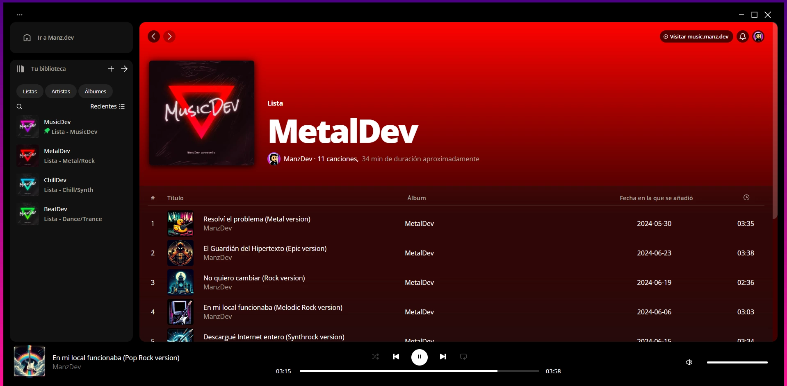

# Music Manz Player
*a.k.a. SpotiManz*

**Music Manz Player** es un clon de la UI de Spotify, construido en Astro utilizando CSS y Javascript vanilla y emitido en directo en [mi canal de Twitch](https://twitch.tv/ManzDev) y resubido a [mi canal de YouTube](https://www.youtube.com/playlist?list=PLx5xbrpW6nXiPRXklsQKiDESH_3tJlLWK).

El objetivo de este proyecto es aprender a utilizar Astro, Javascript vanilla y CSS vanilla con un proyecto real, con canciones que hicimos nosotros mismos utilizando Suno, a raiz del proyecto [music.manz.dev](https://music.manz.dev).

- 🌎 **URL**: [https://music.manz.dev/player](https://music.manz.dev/player)
- 🌎 **Proyecto original**: [https://music.manz.dev/](https://music.manz.dev/)
- 🌎 **Mis redes**: [https://links.manz.dev/](https://links.manz.dev/)

## Tareas por realizar

### Prioritarias

- Reorganizar código en Astro

### No prioritarias

- Implementar el shuffle (random).
- Implementar un skeleton para cuando esté cargando
- Animaciones y feedback al usuario en controles
- Memoizar las funciones de actualización del timeUpdate
- Implementar flechas (botones) de cambiar de lista
- Responsive para adaptar a pantalla (posponer al final)

### Adicionales (en el futuro)

- Buscador de canciones

### Completadas

- [X] Personalizar la barra de scroll
- [X] Barra de progreso cuando reproduces la canción
- [X] Barra de volumen
- [X] List Header (WebComponent)
- [X] Implementar el repeat (loop canción actual)
- [X] Fetch a la lista concreta y cambiar la lista de canciones
- [X] Implementar card de la portada
- [X] Revisar rutas para que apunten a `/player`
